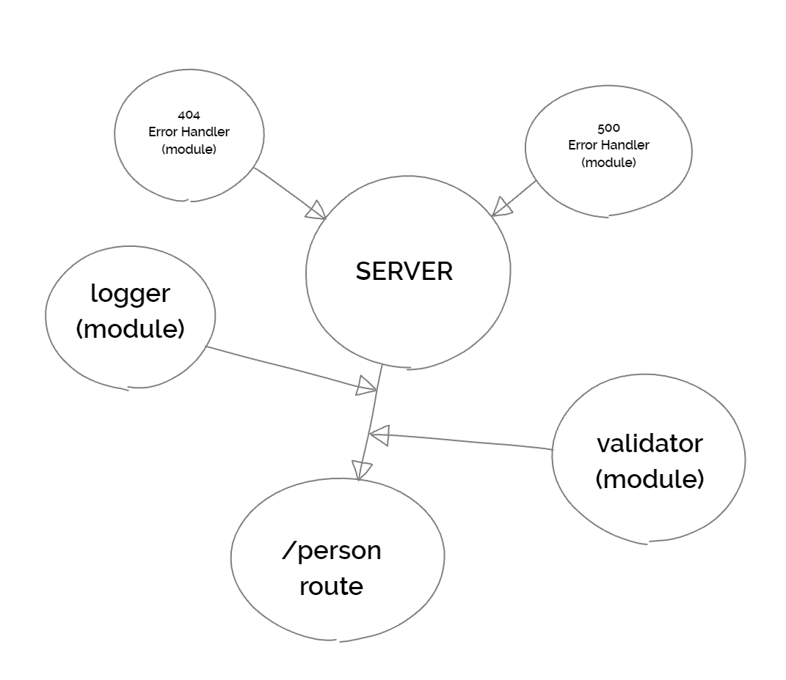

# Lab - 02: Express

## Overview

I build a basic Express server using best practices, including server modularization, use of middleware, and tests.

## Author: William Moreno

## Collaboration

- Carly Dekock
- Jason Dormier
- Jason Quaglia
- Nick Magruder

## Deployment

The app is deployed on Heroku at the following link:

- [basic-express-server](https://wmoreno-basic-express-server.herokuapp.com/person)

## Daily Pull Request

Work was accomplished on the `dev` branch. The pull request to merge the code into the `main` branch is here:

- [Pull Request](https://github.com/William-Moreno/basic-express-server/pull/3)

Working features implemented:
- Express server properly structured
- `index.js` created that requires `server.js`, `dotenv` reading `.env` file and calls the `.start()` method from the server
- `server.js` server 'module' exports object with `.start()` method and reference to express `app`
- middleware including `logger.js` and `validator.js`
- error-handlers including `404.js` and `500.js`
- `/person` route in `server.js` that utilizes `validator.js` middleware and will send a JSON object in the form of `{name: 'fred'}` as a response when a valid name value is entered

## Tests

Test suite created that tests for:
  - 404 on bad route
  - 404 on bad method
  - 500 if no name in the query string
  - 200 if name is in the query string
  - output object is correct if a name is in the query string

All tests successfully passed.

## UML

UML drawing created with [limnu](https://limnu.com/)

